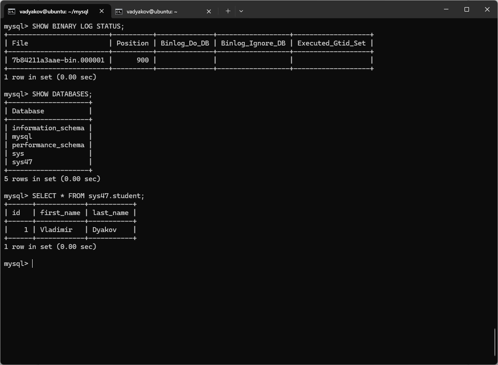
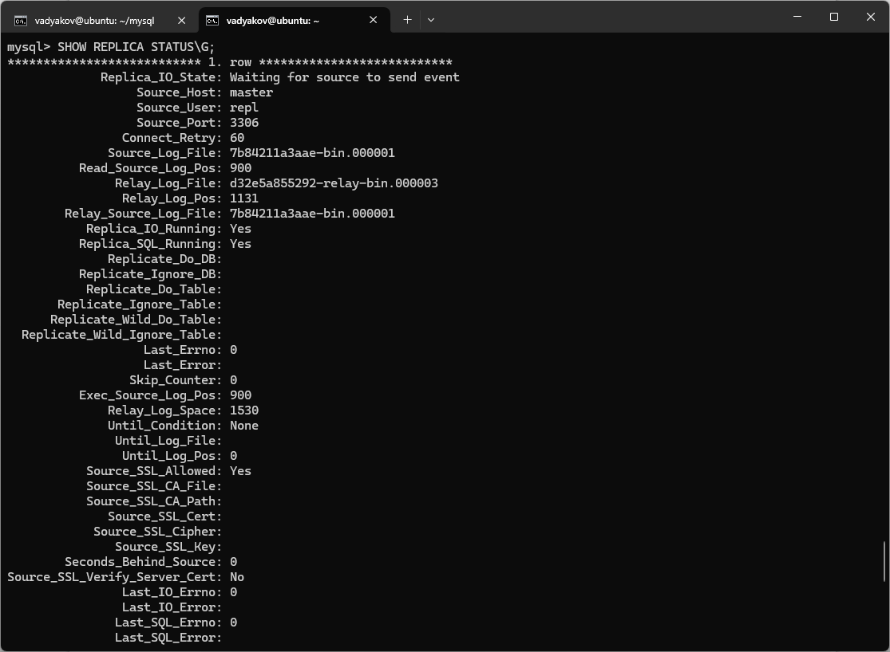
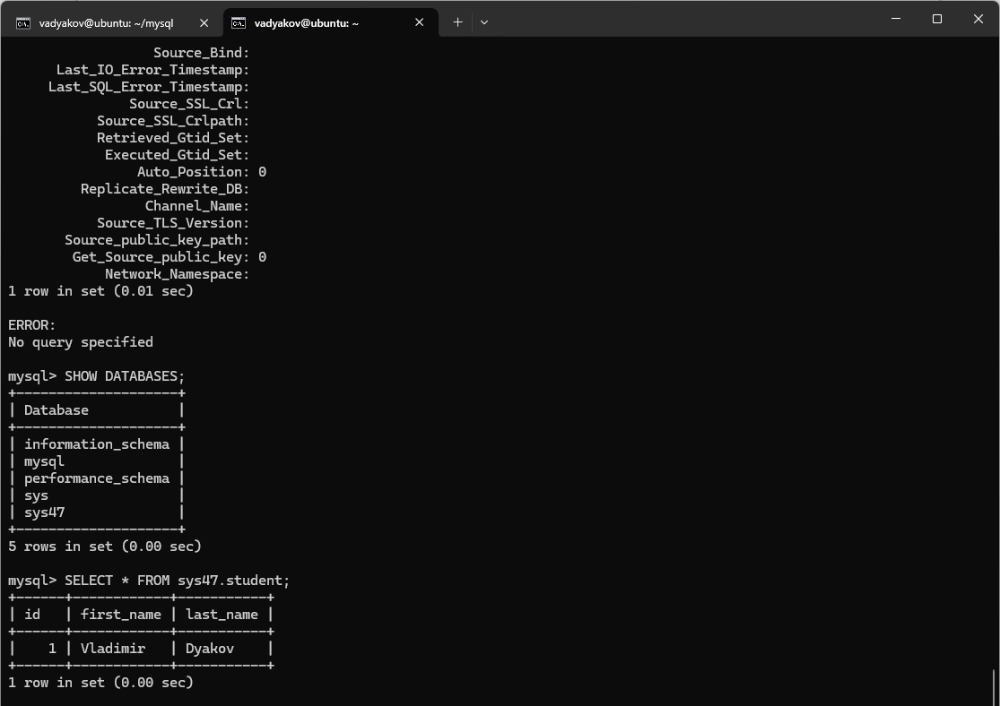
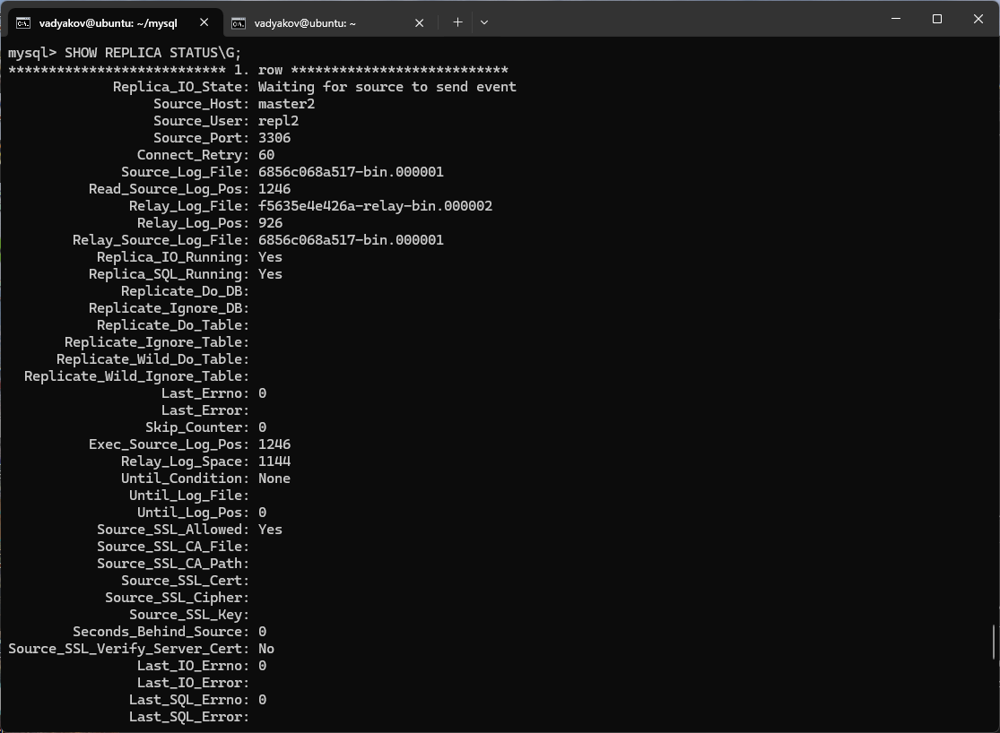
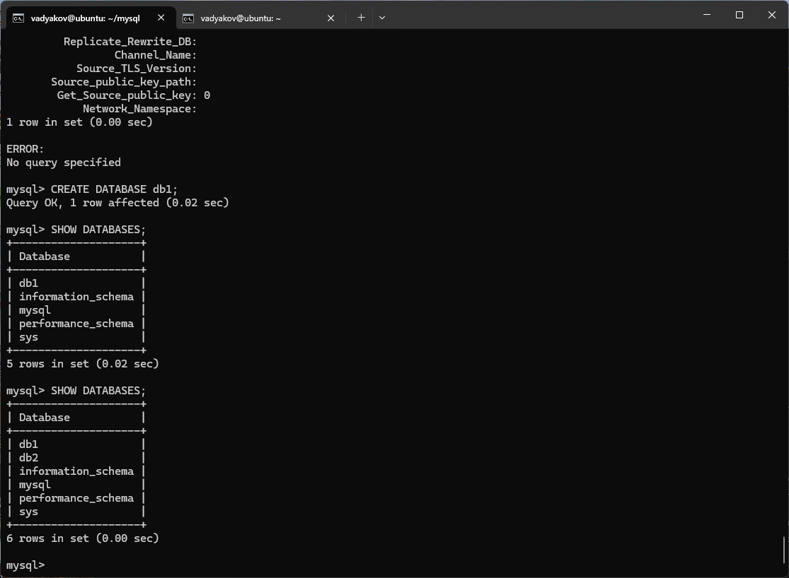
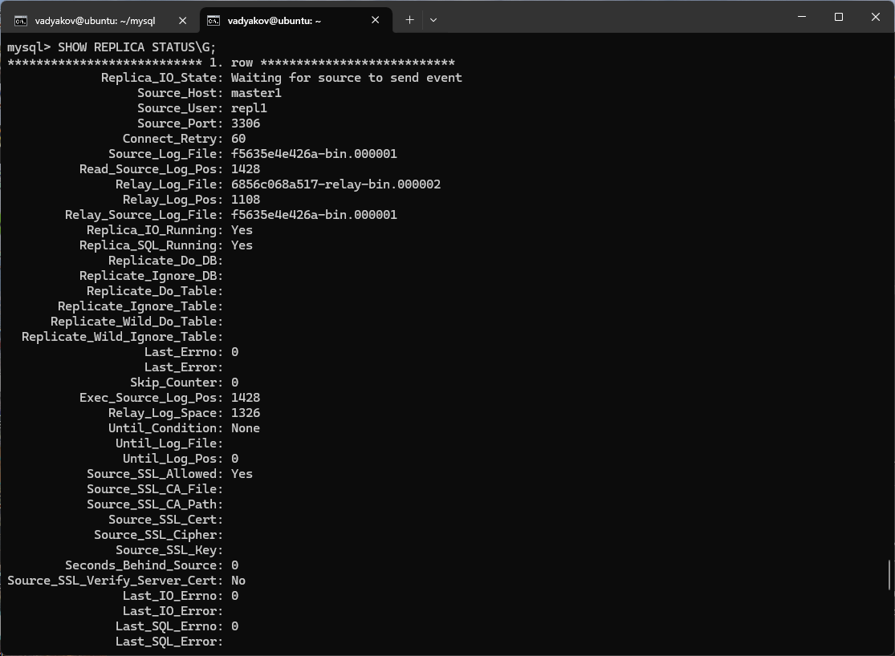
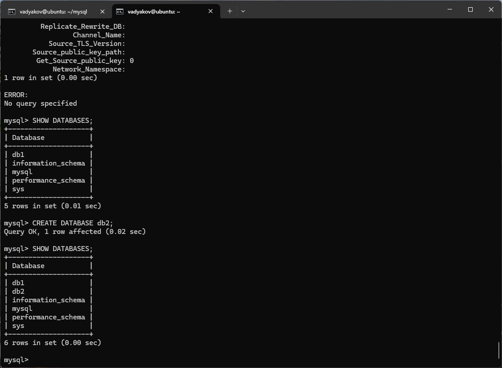

# Домашнее задание к занятию «Репликация и масштабирование. Часть 1» - Дьяков Владимир

### Задание 1

На лекции рассматривались режимы репликации master-slave, master-master, опишите их различия.

*Ответить в свободной форме.*

**Решение:**

Master-Slave — это модель репликации, где существует один главный сервер (Master) и один или несколько подчиненных серверов (Slave).

Принцип работы:
- все операции записи (добавление, изменение, удаление данных) выполняются только на Master;
- Master автоматически передает изменения на Slave-серверы;
- чтение данных может осуществляться как с Master, так и с Slave (чаще используется Slave для снижения нагрузки).

Master-Master — модель, где все серверы равноправны и могут принимать как операции записи, так и чтения.

Принцип работы:
- каждый сервер может выполнять операции чтения и записи;
- изменения автоматически синхронизируются между всеми серверами;
- возможна комбинация с Master-Slave архитектурой.

---

### Задание 2

Выполните конфигурацию master-slave репликации, примером можно пользоваться из лекции.

*Приложите скриншоты конфигурации, выполнения работы: состояния и режимы работы серверов.*

**Решение:**

master:

```
[mysqld]
server_id=1
log_bin
```



slave:

```
[mysqld]
server_id=2
read_only=1
```




---

### Задание 3* 

Выполните конфигурацию master-master репликации. Произведите проверку.

*Приложите скриншоты конфигурации, выполнения работы: состояния и режимы работы серверов.*

**Решение:**

master1:

```
[mysqld]
server_id=1
log_bin
```




master2:

```
[mysqld]
server_id=2
log_bin
```


